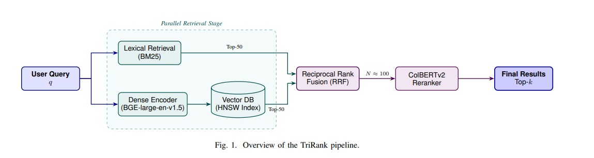

# TriRank: Hybrid Retrieval Framework (BM25 + BGE + ColBERTv2)

A training-free 3-stage hybrid retrieval pipeline combining lexical, dense, and token-level reranking to achieve high-precision retrieval performance on MS MARCO and BEIR benchmarks.

---

## 🧠 Architecture

<p align="center">
  
</p>

<p align="center">
  <em>Figure 1: Overview of the TriRank Pipeline</em>
</p>

---

## 📄 Research Paper

This repository contains the official implementation of our research paper:

**"TriRank: A Hybrid Retrieval Framework Combining BGE-large-en-v1.5 and ColBERTv2 for High-Precision Information Retrieval"**

**Authors:**
- Jasith Kadian  
- Kurian Jose  

---

## 🚀 Key Contributions

- 3-stage hybrid retrieval pipeline:
  - BM25 (lexical retrieval)
  - BGE-large-en-v1.5 (dense retrieval)
  - ColBERTv2 (token-level reranking)
- Training-free architecture (zero fine-tuning required)
- Reciprocal Rank Fusion (RRF) for merging ranked results
- GPU-optimized PyTorch chunked exact search over 8.8M embeddings
- Achieved:
  - nDCG@10 = 0.4638
  - MRR@10 = 0.3825

---

## 💡 What is TriRank?

TriRank is a hybrid retrieval system that combines keyword-based retrieval, semantic understanding, and token-level reranking to improve search precision.

It integrates:
- BM25 for exact keyword matching
- BGE embeddings for semantic similarity
- ColBERTv2 for fine-grained token interaction

---

## 🔄 Pipeline Flow

```
Query → BM25 + Dense Retrieval → RRF Fusion → ColBERTv2 → Final Results
```

---

## ⚙️ Pipeline Breakdown

### Stage 1: Parallel Retrieval
- BM25 for exact keyword matching  
- BGE-large-en-v1.5 for semantic retrieval  

### Stage 2: Dense Retrieval Optimization
- PyTorch chunked exact search  
- Eliminates ANN approximation errors  

### Stage 3: Fusion
- Reciprocal Rank Fusion (RRF)  

### Stage 4: Reranking
- ColBERTv2 with token-level MaxSim scoring  

---

## 📊 Results

| Method | nDCG@10 | MRR@10 |
|--------|--------|--------|
| BM25 | 0.2286 | 0.1796 |
| Dense (BGE) | 0.4376 | 0.3619 |
| TriRank | **0.4638** | **0.3825** |

---

## 🛠️ Installation

```bash
git clone https://github.com/Jasithkadian/TriRank.git
cd TriRank
pip install -r requirements.txt
```

Or manually:

```bash
pip install torch transformers datasets faiss-cpu pyserini sentence-transformers numpy pandas tqdm
```

---

## ▶️ Usage

Run notebooks in this order:

1. notebooks/00_setup.ipynb  
2. notebooks/01_bm25_baseline.ipynb  
3. notebooks/02_bge_dense_baseline.ipynb  
4. notebooks/02_bge_dense_exact.ipynb  
5. notebooks/03_rrf_fusion.ipynb  
6. notebooks/04_colbert_reranking.ipynb  
7. notebooks/05_ablations.ipynb  
8. notebooks/06_beir_benchmarks.ipynb  
9. notebooks/07_analytics.ipynb  

---

## 📁 Project Structure

```
trirank/
│── notebooks/
│── scripts/
│── docs/
│── images/
│── README.md
│── requirements.txt
```

---

## 📦 Datasets

- MS MARCO  
- BEIR Benchmark:
  - SciFact  
  - NFCorpus  
  - ArguAna  
  - TREC-COVID  

Dataset setup instructions are inside:
notebooks/00_setup.ipynb

---

## 🧪 Reproducibility

To reproduce results:
- Run notebooks sequentially  
- Use MS MARCO / BEIR datasets  
- Ensure GPU for dense retrieval  

Expected performance:
- nDCG@10 ≈ 0.4638  
- MRR@10 ≈ 0.3825  

---

## 📌 Additional Resources

- docs/TriRank_Project_Guide.md  
- docs/workflow.md  
- docs/memory_prompt.md  

---

## 📬 Contact

Jasith Kadian  
Email: jasithkadian@gmail.com  
GitHub: https://github.com/Jasithkadian
